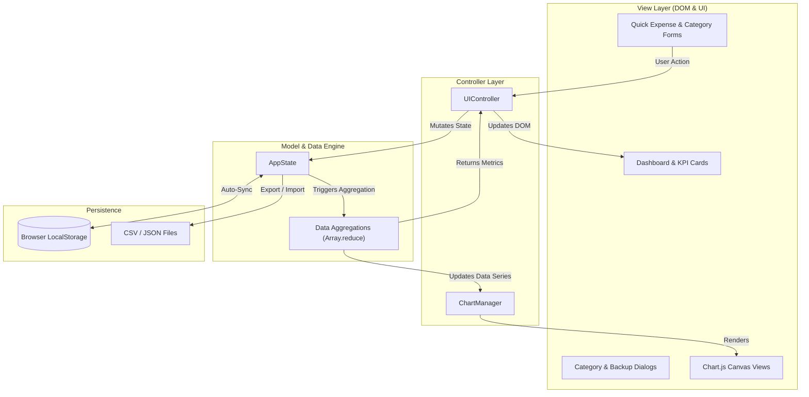

# PROJECT REPORT: SmartBudget — Monthly Budget Planner & Expense Analytics

---

## 1. Executive Summary

**SmartBudget** is a client-side monthly personal finance web application engineered using modern HTML5, vanilla CSS3, and JavaScript (ES6+), integrated with the **Chart.js** data visualization library. The system enables users to establish monthly category budget limits, log daily expenses, monitor spending distribution, and analyze financial health through real-time over-budget warning indicators and dynamic charts. 

All financial metrics, groupings, and timeline trajectories are computed on the client side using functional programming patterns—specifically leveraging **`Array.prototype.reduce`** for data aggregation, with persistent state maintained via browser **LocalStorage**.

---

## 2. Project Objectives

- **Practice Data Aggregation**: Group, sum, and transform multi-dimensional transaction records using JavaScript functional methods (`reduce`, `filter`, `map`).
- **Data Visualization**: Integrate and manage canvas-rendered charts using Chart.js to compare budgeted vs. actual expenditures.
- **Form Handling & Input Validation**: Build robust forms for dynamic category management and transaction entry with real-time feedback.
- **Visual Alert Architecture**: Implement a multi-tier warning system (Safe, Near Limit, Over Budget) to alert users when spending exceeds set thresholds.
- **Data Persistence & Portability**: Provide zero-dependency client-side persistence with CSV and JSON data export/import capabilities.

---

## 3. Technology Stack & Tools

| Component | Technology / Library | Purpose |
| :--- | :--- | :--- |
| **Markup** | HTML5 | Semantic structure, accessible dialogs, form inputs |
| **Styling** | Vanilla CSS3 | Custom design system, glassmorphism, responsive CSS Grid/Flexbox |
| **Logic & State** | JavaScript (ES6+) | Object-oriented state management, `reduce` aggregation pipelines |
| **Visualization** | Chart.js (v4.4.1) | Dynamic Bar, Doughnut, and Line charts |
| **Iconography** | Lucide Icons | Clean SVG UI icons |
| **Storage** | Web Storage API (LocalStorage) | Automatic client-side session persistence |
| **Export Formats** | CSV / JSON | Spreadsheet export and database backup restoration |

---

## 4. System Architecture & Component Design

The application adheres to an **MVC-inspired (Model-View-Controller)** decoupled architecture:



### Key Modules:
1. **`AppState` (Model)**: Manages categories, expense records, and active month selector; handles synchronization with `localStorage`.
2. **`ChartManager` (Visualization Controller)**: Controls lifecycle, data injection, responsive resizing, and dynamic theme colors for Chart.js instances.
3. **`UIController` (View Controller)**: Handles event listeners, DOM rendering, form validation, filter pills, and toast notification alerts.

---

## 5. Core Mathematical Formulations & `Array.reduce` Implementations

### 5.1 Category Spending Aggregation
Groups and sums individual transactions into a category hash map in a single $O(N)$ pass:
$$\text{Spent}_{\text{category}} = \sum_{i=1}^{n} \text{Expense}_i \quad \forall \text{Expense}_i \in \text{Category}$$

```javascript
getSpendingByCategory() {
  const monthExpenses = this.getMonthExpenses();
  return monthExpenses.reduce((acc, exp) => {
    acc[exp.categoryId] = (acc[exp.categoryId] || 0) + Number(exp.amount);
    return acc;
  }, {});
}
```

### 5.2 Total Monthly Budget & Total Monthly Spent
$$\text{Total Budget} = \sum_{c=1}^{k} \text{Budget}_c, \quad \text{Total Spent} = \sum_{j=1}^{m} \text{Amount}_j$$

```javascript
getTotalBudget() {
  return this.categories.reduce((total, cat) => total + (Number(cat.budget) || 0), 0);
}

getTotalSpent() {
  const monthExpenses = this.getMonthExpenses();
  return monthExpenses.reduce((total, exp) => total + (Number(exp.amount) || 0), 0);
}
```

### 5.3 Over-Budget Warning & Excess Calculation
Evaluates individual category status against budgeted thresholds:
$$\text{Excess} = \max(0, \text{Spent}_c - \text{Budget}_c)$$

```javascript
getOverBudgetSummary() {
  const breakdown = this.getCategoryBreakdown();
  return breakdown.reduce((summary, cat) => {
    if (cat.isOverBudget) {
      summary.overBudgetCount += 1;
      summary.totalExcess += cat.excessAmount;
      summary.overBudgetCategories.push(cat);
    }
    if (cat.isNearLimit) {
      summary.nearLimitCount += 1;
      summary.nearLimitCategories.push(cat);
    }
    return summary;
  }, { overBudgetCount: 0, totalExcess: 0, overBudgetCategories: [], nearLimitCount: 0, nearLimitCategories: [] });
}
```

---

## 6. Key Features & Functionality

### 6.1 Interactive Multi-View Charts
- **Budget vs Actual (Grouped Bar Chart)**: Compares planned budget vs actual spending per category side-by-side with dynamic color coding (Crimson for over budget, Amber for near limit, Emerald for safe).
- **Category Spending Share (Doughnut Chart)**: Visualizes the proportion of expenditures across categories with centered total spending summaries and interactive legends.
- **Daily Spending Velocity (Line Chart)**: Plots cumulative daily spend trajectory across the month compared to a linear pacing baseline.

### 6.2 Three-Tier Over-Budget Warning System
1. **Safe (`< 75%` of budget)**: Emerald progress bar and neutral badge.
2. **Near Limit (`75% – 99.9%` of budget)**: Amber progress bar with warning tag.
3. **Over Budget (`≥ 100%` of budget)**: Pulsing crimson card border, animated candy-striped progress bar, top dashboard alert banner, and instant toast warning on transaction entry.

### 6.3 Category & Expense Management
- Create custom categories with tailored names, monthly budget limits, icons, and color palettes.
- Log expenses with descriptions, dollar amounts, category selectors, dates, and payment methods.
- Filter transactions by category and search by merchant/note with instant debounced table updates.

### 6.4 Data Portability & Persistence
- Automatically persists all state in `localStorage`.
- **CSV Export**: Downloads a clean spreadsheet-ready file of the active month's expenses.
- **JSON Export & Import**: Provides full database backup and restore capabilities.

---

## 7. Testing & Verification

| Test Case | Input / Action | Expected Result | Status |
| :--- | :--- | :--- | :--- |
| **TC-01: Default Load** | Open `index.html` on fresh browser | Default 8 categories load with sample expenses, KPI metrics render correctly. | ✅ Pass |
| **TC-02: Add Expense** | Add $300 expense to "Shopping" ($250 budget) | Category status transitions to "Over Budget" (+$50 OVER), top banner updates, toast alert triggers. | ✅ Pass |
| **TC-03: Create Category** | Create "Travel" with $800 budget | New category card appears, total monthly budget increases by $800, category dropdown updates. | ✅ Pass |
| **TC-04: Chart Switch** | Click "Category Share" & "Daily Velocity" tabs | Chart canvas dynamically switches without page reload or rendering glitches. | ✅ Pass |
| **TC-05: Month Switch** | Shift to Next Month | Expenses filter to new month, charts and KPI metrics re-calculate for empty/fresh period. | ✅ Pass |
| **TC-06: CSV Export** | Click "Export to CSV" | Downloads structured `.csv` file formatted with Date, Description, Category, Amount, Payment Method. | ✅ Pass |
| **TC-07: Persistence** | Refresh page after adding records | All modified categories and added expenses persist intact from LocalStorage. | ✅ Pass |

---

## 8. Conclusion & Future Enhancements

The **SmartBudget** application successfully accomplishes all functional and aesthetic criteria specified in the project requirements. It demonstrates practical mastery of functional data manipulation (`Array.prototype.reduce`), modern UI/UX design paradigms (dark glassmorphism, responsive grid, micro-animations), real-time input validation, and Chart.js data visualization.

### Future Scope:
- Multi-currency conversion support (EUR, GBP, INR, JPY).
- Recurring monthly expense automation (subscriptions & utility bills).
- Receipt image OCR scanning to automatically populate expense amounts and merchants.
- Cloud database synchronization with Firebase/Supabase for multi-device access.
